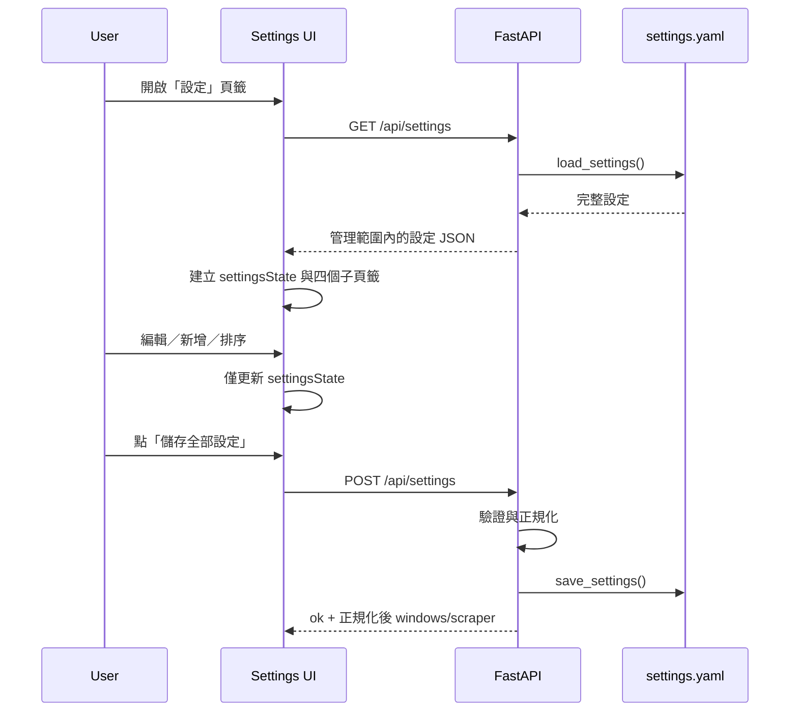

# L2｜設定頁（從零實作規格）

## 1. 目的與邊界

設定頁管理下一次 Pipeline 的追蹤條件與 crawler 行為。它的 source of truth 是 `config/settings.yaml`，**不直接讀寫 SQLite**。SQLite 中既有航班與快照不因儲存設定而被修改；新設定只在下一次 Pipeline 建立 crawler、工作清單與配對候選時生效。

| 項目 | 規格 |
| --- | --- |
| 前端容器 | `#tab-settings` |
| 子頁籤 | `region`、`window`、`airline`、`scraper` |
| 後端檔案 | `src/api/server.py` |
| 設定讀寫 | `src/config.py::load_settings()`、`save_settings(data)` |
| 設定檔 | `config/settings.yaml` |
| SQLite 對應 | 無直接 table；下一次 Pipeline 依 YAML 影響 `flight_instances` 與票價快照。 |

## 2. 前端狀態與載入流程

前端維護一份未儲存的 `settingsState`，不可在每個 input change 時直接呼叫 API。



進入頁籤時呼叫 `loadSettings()`；成功後：

1. 保存 API 回應至 `settingsState`。
2. 對舊版 window 補出 `outbound_before`／`inbound_before` 與 `query_order` 預設值；對缺少 `airlines.<code>.enabled` 的舊 YAML 補為 `!is_lcc`，僅供前端編輯，首次成功儲存後才寫回 YAML。
3. 以 `settingsState` render 四個子頁籤。
4. 所有儲存前錯誤顯示在 `#settings-save-status`，不得覆蓋使用者輸入。

## 3. API 契約

### 3.1 讀取設定

```http
GET /api/settings
Accept: application/json
```

成功回應：`200 OK`

```json
{
  "origins": ["TPE", "TSA"],
  "destinations": [
    {"iata": "KIX", "name_zh": "大阪"},
    {"iata": "NGO", "name_zh": "名古屋"}
  ],
  "windows": {
    "JULY_SAT": {
      "group": "JULY_2027",
      "label": "7月7天",
      "query_order": 1,
      "outbound_before": "2027-07-11T15:00",
      "inbound_before": "2027-07-17T20:00"
    }
  },
  "airlines": {
    "BR": {"name_zh": "長榮航空", "is_lcc": false, "enabled": true},
    "CI": {"name_zh": "中華航空", "is_lcc": false, "enabled": true}
  },
  "scraper": {
    "default_source": "google_flights",
    "headless": true,
    "timeout_ms": 30000,
    "google_flights_max_advance_days": 330,
    "result_ready_timeout_ms": 10000,
    "roundtrip_candidate_limit_per_airline": 2,
    "roundtrip_candidate_max_per_airline": 4,
    "retry_attempts": 3,
    "retry_delays_seconds": [2, 5],
    "persist_failure_diagnostics": true,
    "capture_browser_diagnostics": false,
    "crawler_audit_retention_days": 90
  },
  "strict_time_rules": {}
}
```

### 3.2 儲存設定

```http
POST /api/settings
Content-Type: application/json
```

request body 所有最上層欄位皆必填；`scraper` 可傳空物件，後端會與既有值及預設值合併。

```json
{
  "origins": ["TPE", "TSA"],
  "destinations": [
    {"iata": "KIX", "name_zh": "大阪"}
  ],
  "windows": {
    "JULY_SAT": {
      "group": "JULY_2027",
      "label": "7月7天",
      "query_order": 1,
      "outbound_before": "2027-07-11T15:00",
      "inbound_before": "2027-07-17T20:00"
    }
  },
  "airlines": {
    "BR": {"name_zh": "長榮航空", "is_lcc": false, "enabled": true}
  },
  "scraper": {
    "headless": true,
    "timeout_ms": 30000,
    "google_flights_max_advance_days": 330,
    "result_ready_timeout_ms": 10000,
    "roundtrip_candidate_limit_per_airline": 2,
    "roundtrip_candidate_max_per_airline": 4,
    "retry_attempts": 3,
    "retry_delays_seconds": [2, 5],
    "persist_failure_diagnostics": true,
    "capture_browser_diagnostics": false,
    "crawler_audit_retention_days": 90
  },
  "strict_time_rules": {}
}
```

成功回應：`200 OK`

```json
{
  "ok": true,
  "windows": {"JULY_SAT": {"query_order": 1}},
  "scraper": {
    "default_source": "google_flights", "headless": true, "timeout_ms": 30000,
    "result_ready_timeout_ms": 10000, "google_flights_max_advance_days": 330,
    "roundtrip_candidate_limit_per_airline": 2, "roundtrip_candidate_max_per_airline": 4,
    "retry_attempts": 3, "retry_delays_seconds": [2.0, 5.0],
    "persist_failure_diagnostics": true, "capture_browser_diagnostics": false,
    "crawler_audit_retention_days": 90
  }
}
```

失敗回應：`422 Unprocessable Entity`

```json
{"detail": "爬蟲設定 retry_attempts 必須介於 1 到 5"}
```

前端在 `res.ok === false` 時解析 `detail`，顯示 `儲存失敗：<detail>`；不得呼叫 `refreshDynamicOptions()`，也不得清空 `settingsState`。

## 4. 後端實作流程

`POST /api/settings` 的實作順序必須為：

1. 以 request model 驗證最上層 JSON 型別。
2. `load_settings()` 讀取完整既有 YAML。
3. 逐筆正規化 `windows` 的 `query_order` 為正整數，並驗證去程截止早於回程截止；非法值回 422。
4. 將 request 的 `scraper` 與後端預設、既有 `scraper` 合併，再驗證數值範圍、candidate max 不小於 initial limit 與 retry delays。
5. 只覆寫 `origins`、`destinations`、`windows`、`airlines`、`scraper`、`strict_time_rules` 六個區塊。
6. 保留 `database`、`reports`、`exchange_rates`、`phase1_costs` 等其他 YAML 區塊原值。
7. 呼叫 `save_settings(settings)`；該函式必須清除 `load_settings` cache。
8. 回傳正規化後的完整 `windows` 與完整 `scraper`；前端可安全覆蓋其對應 state，不得因 partial response 遺失設定。

## 5. 四個子頁籤

### 5.1 地區（`region`）

| UI 欄位／操作 | `settingsState`／request 對應 | 驗證與行為 |
| --- | --- | --- |
| 出發機場輸入 | `origins: string[]` | 以逗號拆分、trim、轉大寫、移除空值。 |
| 目的地 IATA | `destinations[].iata` | 新增時必填；trim、轉大寫。 |
| 目的地名稱 | `destinations[].name_zh` | 新增時必填；可編輯。 |
| 上移／下移 | `destinations` 陣列順序 | 不需立即 POST；儲存後影響下拉、結果與 Phase 1 順序。 |
| 刪除 | 從陣列移除 | 不立即刪 SQLite 舊資料。 |

### 5.2 時段（`window`）

`windows` 是以代碼為 key 的 map：`Record<string, WindowConfig>`。

| 欄位 | 型別 | 規則／下游用途 |
| --- | --- | --- |
| key | `string` | 唯一、trim、轉大寫、不可空；供 API filter、日誌與 `roundtrip_price_snapshots.window_key` 使用。 |
| `group` | `string` | 同月份候選回程的比較群組。 |
| `label` | `string` | UI 顯示文字。 |
| `query_order` | `integer >= 1` | Pipeline、下拉與結果排序；同值保持 YAML 宣告順序。 |
| `outbound_before` | `YYYY-MM-DDTHH:mm` | 去程日期與嚴格截止時間。 |
| `inbound_before` | `YYYY-MM-DDTHH:mm` | 回程日期、截止時間與星期顯示。 |

時段卡需求：

- 重新命名必須搬移 map key 並保留整個 value；新 key 已存在時拒絕。
- 「複製設定」只帶入新增表單，不產生任何資料列；代碼欄清空並聚焦。
- 新增前檢查 key、group、正整數順序、去／回程日期時間都存在；去程截止必須早於回程截止。
- 使用 `input[type=datetime-local]`，不可拆分日期與時間；截止比較語意一律為嚴格小於。

### 5.3 航空公司（`airline`）

`airlines` 為 `Record<string, { name_zh: string, is_lcc: boolean, enabled: boolean }>`；`is_lcc` 是分類，`enabled` 是追蹤範圍，兩者互不推導。

| UI 欄位 | request 對應 | 行為 |
| --- | --- | --- |
| 代碼 | `airlines.<CODE>` | 新增時 trim、轉大寫。 |
| 中文名稱 | `name_zh` | 顯示與結果配對名稱。 |
| 是否納入查詢 | `enabled` | 勾選為 `enabled=true`；取消勾選為 `enabled=false`，Stage 1 與 Stage 2 均排除。 |
| 是否廉航 | `is_lcc` | 只作分類與結果標示；不因取消追蹤而改變。 |

刪除航空公司只改 YAML，既有 DB 快照保留供歷史查核。

### 5.4 爬蟲（`scraper`）

| UI 欄位 | request key | 型別／範圍 | crawler 使用點 |
| --- | --- | --- | --- |
| 無頭模式 | `headless` | boolean | `chromium.launch(headless=...)`。 |
| 單次逾時 | `timeout_ms` | integer，1,000–120,000 | page goto 與不可恢復的操作上限。 |
| 結果頁就緒等待 | `result_ready_timeout_ms` | integer，2,000–30,000，預設 `10,000` | Stage 2 等待去程／回程結果的多訊號狀態（metadata 或公開結果卡）；逾時即進入重試，不再固定耗盡單次逾時。 |
| 最大提前天數 | `google_flights_max_advance_days` | integer，1–500 | 呼叫 Playwright 前的日期 guard。 |
| 初始候選數 | `roundtrip_candidate_limit_per_airline` | integer，1–5 | Stage 2 每家航空公司先以去／回程各 N 班查價。 |
| 候選補位上限 | `roundtrip_candidate_max_per_airline` | integer，1–8，預設 `4`，且不得小於初始候選數 | 初選中有去程未售／未渲染時，以同航空公司的下一班補位；最多保留至此數量，避免一開始展開所有組合。 |
| 重試總次數 | `retry_attempts` | integer，1–5，含首次 | Google crawler 暫時性錯誤最大嘗試次數。 |
| 重試等待秒數 | `retry_delays_seconds` | `number[]`，每項 0–60 | 長度必須等於 `retry_attempts - 1`。 |
| 保存失敗診斷摘要 | `persist_failure_diagnostics` | boolean，預設 `true` | 是否寫入回程 selector／卡片計數／錯誤等結構化摘要；不保存完整 HTML。 |
| 保存失敗瀏覽器診斷 | `capture_browser_diagnostics` | boolean，預設 `false` | 啟用後，失敗或回程未渲染 attempt 保存 Playwright Trace、截圖與安全 Markdown 頁面摘要；成功 attempt 一律丟棄。 |
| 稽核保留天數 | `crawler_audit_retention_days` | integer，1–365，預設 `90` | 每次 Pipeline 初始化時刪除超過天數的 run／attempt／diagnostic。 |

前端把「重試等待秒數」文字輸入（例如 `2, 5`）切割為 number array。空片段略過；任何 `NaN`、負數、超過 60 秒或數量不符都由後端回 422。

爬蟲稽核紀錄一律保存；`persist_failure_diagnostics=false` 時只省略 `crawler_diagnostics`，不得省略 `crawler_runs` 與 `crawler_attempts`。`capture_browser_diagnostics=true` 僅保存失敗／待補查 attempt 的公開結果頁診斷產物；不得保存 Cookie、帳號、付款資訊、完整 HTML 或網路 request/response body；產物依 `crawler_audit_retention_days` 一起清理。

Stage 2 每個 attempt 另保存 `ROUNDTRIP_PHASE_TIMINGS` 診斷，記錄去程結果頁就緒、旅客設定與每個去程選取後等待回程的耗時；此資料用於辨識網站載入、selector 與重試造成的延遲，不影響票價判定。

同一 `origin + destination + 去程日 + 回程日` 的 Stage 2 工作必須共用同一個 Google Flights 來回搜尋 session，依序選取各航空公司的去程候選；每個去程只接受其所屬航空公司、且已通過 Stage 1 與嚴格時間規則的回程航班。不得為每家航空公司另開瀏覽器或允許跨航空公司組合。

共用 session 的第一個候選必須完整設定並驗證旅客組成；後續候選僅在結果頁可確認相同旅客總數時重用既有組成。若無法確認，必須回退至完整設定與驗證流程，不得假設設定仍存在。

## 6. 前端儲存演算法

```javascript
async function saveSettings() {
  // 1. 從四個子頁籤同步 UI → settingsState。
  // 2. 將 retry delay 字串轉成 number[]。
  // 3. POST /api/settings，Content-Type: application/json。
  // 4. 成功：以 response.windows / response.scraper 覆蓋正規化結果；更新動態下拉。
  // 5. 失敗：保留 state，顯示 detail。
}
```

儲存成功後必須重新呼叫 `refreshDynamicOptions(settingsState)`，使主控台目的地／時段與航班決策篩選立即反映設定；不需重啟服務。

## 7. 錯誤處理矩陣

| 情境 | 後端行為 | 前端行為 | 資料保護／重試 |
| --- | --- | --- | --- |
| 初次 `GET /api/settings` 網路失敗 | 無副作用 | 在設定區顯示「設定載入失敗：…」，不可 render 空白表單覆蓋現況 | 提供重新載入；不建立或清空 `settingsState`。 |
| GET 回 500／非 JSON | 無副作用 | 顯示 HTTP 狀態或通用錯誤 | 可重新載入；不假設預設值已保存。 |
| POST 422 驗證失敗 | 不呼叫 `save_settings()`，YAML 不變 | 顯示 `detail`，停留原子頁籤 | 保留全部未儲存輸入；使用者修正後可重送。 |
| POST 網路中斷／timeout | 伺服器是否已寫入不可由前端假設 | 顯示「儲存結果未知，請重新載入確認」 | 不清除 state、不宣稱成功；提供重新讀取。 |
| POST 回 500 | 伺服器須避免寫入半份 YAML；失敗前後 YAML 必須保持可解析 | 顯示「儲存失敗」，保留 state | 可重試；不得自動連續重送。 |
| 目的地／時段新增欄位不完整 | 前端可先阻擋；後端仍須驗證 | 欄位旁或儲存列指出缺少欄位 | 不送 API 或收到 422 後保留輸入。 |
| 時段 key 空白或重複 | 前端立即拒絕；後端最終仍須拒絕 | 還原原 key，顯示錯誤 | 不改動其他 windows。 |
| retry delays 格式錯誤 | 422，YAML 不變 | 顯示「重試等待秒數須為 0–60 的數字，且數量須等於重試次數減一」 | 保留原始文字，讓使用者修正。 |
| 回程截止不晚於去程截止／候選補位小於初始候選 | 422，YAML 不變 | 指出對應欄位與規則 | 保留全部未儲存輸入。 |

### 後端原子性要求

- `save_settings()` 必須只在所有 request 驗證通過後呼叫一次。
- 不得先更新部分 `windows`、再因 `scraper` 驗證失敗而留下半份設定。
- 寫檔失敗時 API 回 500，並保留最後一份可解析的 `settings.yaml`；建議以暫存檔寫入成功後再原子取代正式檔。

### 前端按鈕狀態

- 儲存開始後，`儲存全部設定` 必須 disabled 並顯示「儲存中…」，避免重複 POST。
- 成功、422、網路錯誤與 500 都必須在 finally 還原按鈕可用狀態。
- 成功前不得更新主控台的目的地／時段下拉選單；只有成功後才呼叫 `refreshDynamicOptions()`。

## 8. 驗收案例

| ID | 操作 | 預期 |
| --- | --- | --- |
| ST-01 | 修改目的地排序後儲存 | YAML 陣列順序改變；主控台與 Phase 1 順序同步。 |
| ST-02 | 改時段 key 為空或重複 | 前端拒絕或 API 422；原卡不被覆寫。 |
| ST-03 | 複製時段 | 只填新增表單，無 `_COPY` 與無自動新增。 |
| ST-04 | `retry_attempts=3`、delays `2,5` | POST 200，下一次 crawler 最多三次嘗試。 |
| ST-05 | `retry_attempts=3`、delays `2` | POST 422，YAML 保持原值。 |
| ST-06 | 清除全部 DB 後儲存設定 | 設定仍保存；設定頁不重建或刪除 SQLite。 |
| ST-07 | 將傳統航空取消納入查詢 | 僅 `enabled=false`；`is_lcc` 保持 false，下一次 Stage 1／2 不使用該航空。 |
| ST-08 | 回程截止早於去程或 candidate max 小於 initial limit | POST 422，YAML 不變且保留使用者輸入。 |
