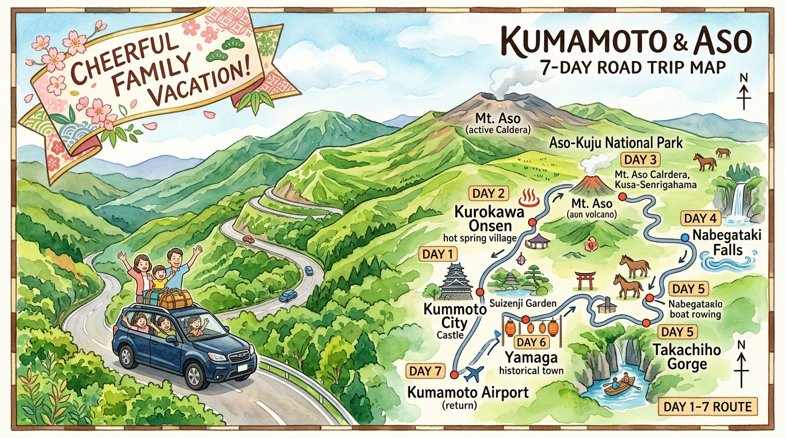

# 第二章：每日詳細行程 (Day 1 - Day 7)

[🏠 返回總目錄](./00_Index.md)

[⬅️ 上一頁 (第一章)](./01_Chapter1_核心戰報與財務預算.md) | [➡️ 下一頁 (Day 1)](./02.01_Day1_抵達熊本與櫻町放電.md)

本章節將 7 天行程整理為詳細的每日動線，包含時間規劃、景點導航與貼心提醒，確保全家在暑假期間依然能悠閒享受行程。

---

### 🗓️ 7 日行程總覽表

| 天數 | 日期 | 主要行程地點 | 主要交通工具 | 當晚住宿飯店／民宿 |
| :---: | :---: | :--- | :--- | :--- |
| [D1](./02.01_Day1_抵達熊本與櫻町放電.md) | **8/09 (日)** | 桃園機場 ➔ 熊本機場 ➔ 熊本市區 (下通 / 櫻町) | 產交巴士 ＋ 步行 | OMO5 熊本 by 星野集團 |
| [D2](./02.02_Day2_熊本城巡禮與領車任務.md) | **8/10 (一)** | 熊本市區 (水前寺成趣園 / 熊本城周邊 / AMU Plaza / 領車) | 熊本市電 ＋ 租車取車 | OMO5 熊本 by 星野集團 |
| [D3](./02.03_Day3_Greenland全日遊.md) | **8/11 (二)** | 熊本市區 ➔ 荒尾市 (Greenland 樂園) ➔ 熊本市區 | 自駕 | OMO5 熊本 by 星野集團 |
| [D4](./02.04_Day4_挺進阿蘇與農場探險.md) | **8/12 (三)** | 熊本市區 ➔ 南阿蘇 (新阿蘇大橋 / 草千里) ➔ 阿蘇農場 | 自駕 | 阿蘇農場 (Aso Farm Land) |
| [D5](./02.05_Day5_農場深度玩與和牛烤肉.md) | **8/13 (四)** | 阿蘇農場 ➔ JR 阿蘇車站 (思夢樂) ➔ 阿蘇宮地 (La Vista / 門前町) | 自駕 | Aso La Vista／阿蘇の家 |
| [D6](./02.06_Day6_阿蘇神社與大津慶功.md) | **8/14 (五)** | 阿蘇神社門前町 ➔ 大津町 (AEON / 機場還車 / 燒肉慶功) | 自駕 ＋ 計程車 | Vessel Hotel 熊本機場大津 |
| [D7](./02.07_Day7_機場最後衝刺.md) | **8/15 (六)** | 大津町 ➔ 熊本機場 ➔ 桃園機場 | 預約包車計程車 ＋ 飛機 | 溫暖的家 |

---

#### **💡 行程小提醒 **
全家暢遊熊本阿蘇期間，建議留意以下實務經營原則：

1. **親子步調與彈性調整**：全行程以孩子體力與舒適度為核心，行程留有餘裕，遇午後高溫或體力下降隨時微調動線或至室內商場休息。
2. **山區自駕與加油備忘**：D2 傍晚領車後開啟自駕，山區道路多彎道與山路，行車保持安全車距；D6 還車前記得至大津或機場門市附近指定加油站加滿 Regular 並保留收據。
3. **退稅與商場營業時間**：市區大型百貨（如鶴屋百貨、AMU Plaza）退稅專櫃多於 19:00–19:30 提前結束，建議購物集中提早結帳退稅；伴手禮採買集中於 AEON 大津店。

---
[⬅️ 上一頁 (第一章)](./01_Chapter1_核心戰報與財務預算.md) | [➡️ 下一頁 (Day 1)](./02.01_Day1_抵達熊本與櫻町放電.md)

[🏠 返回總目錄](./00_Index.md)
